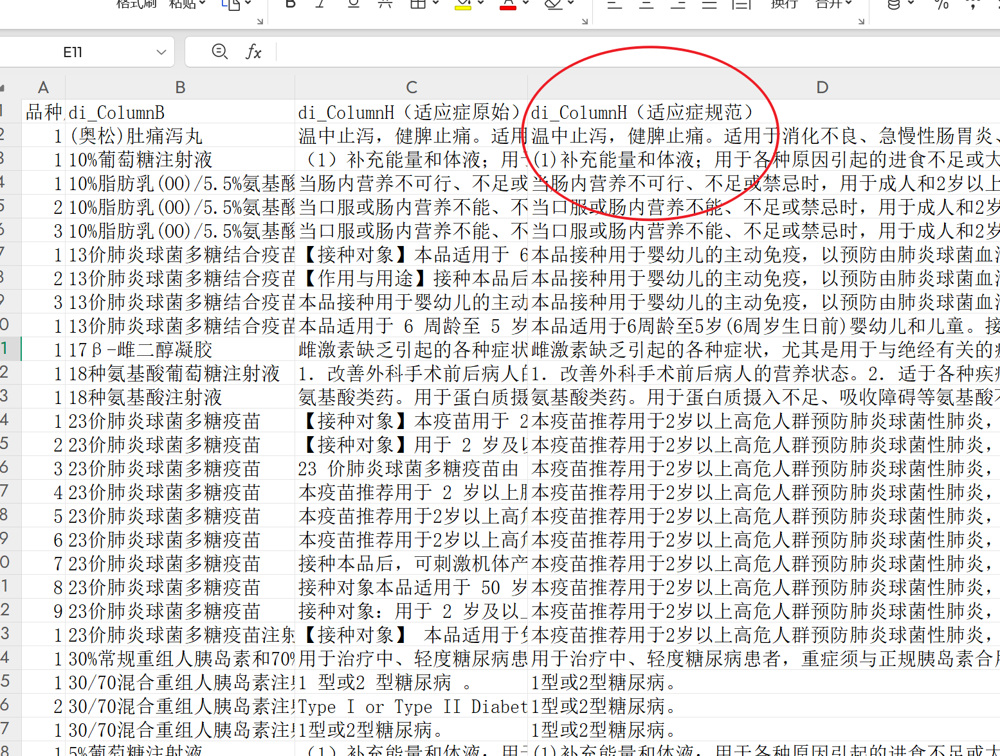
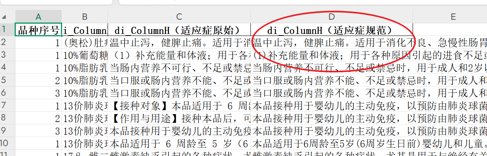
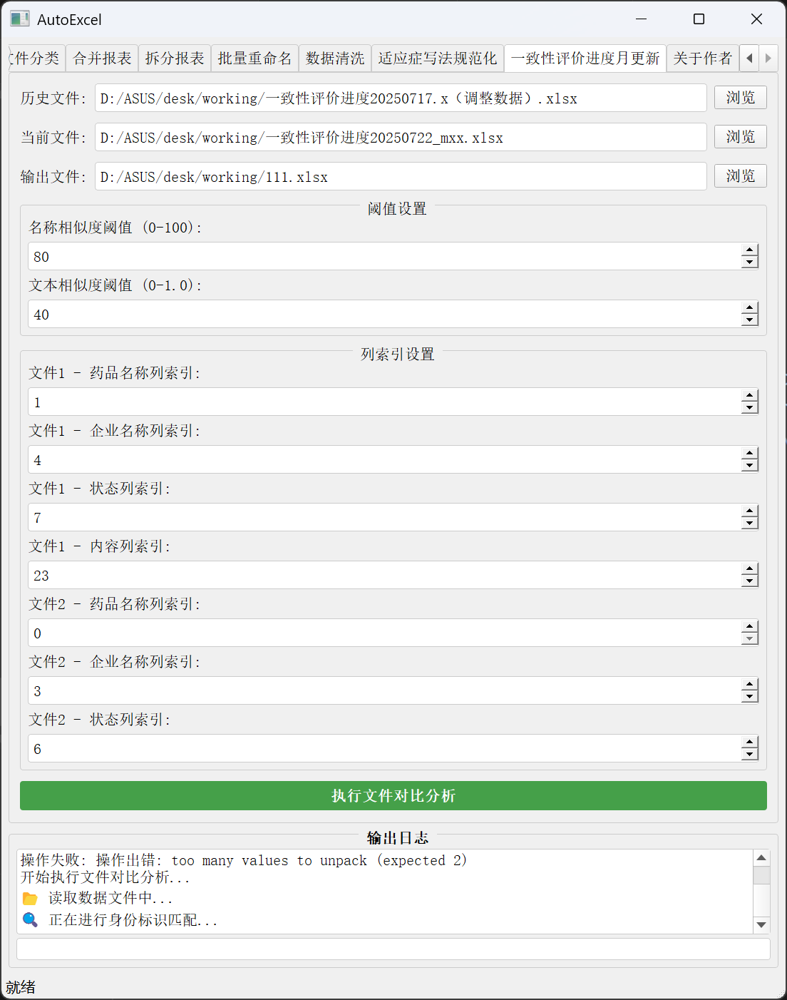
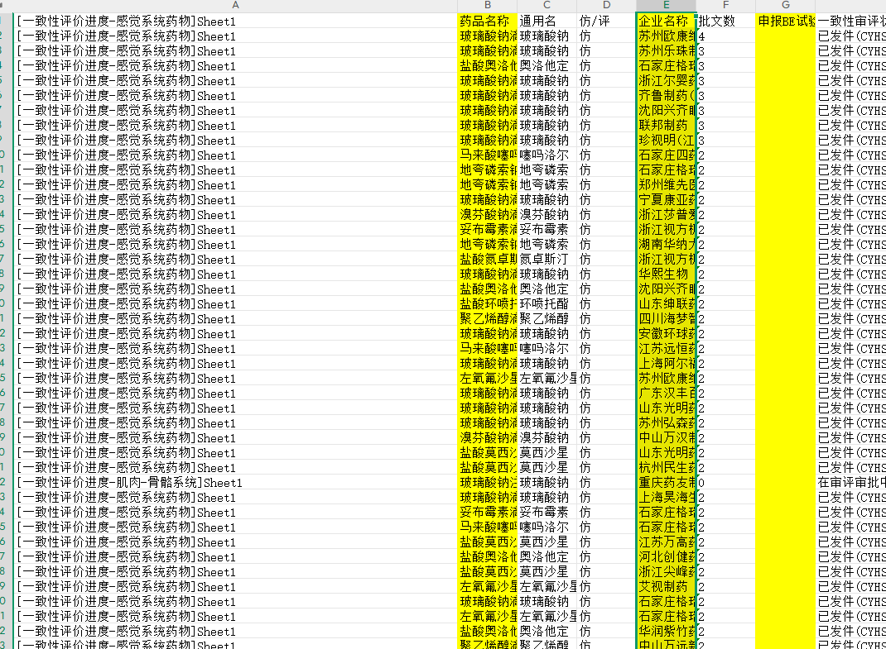
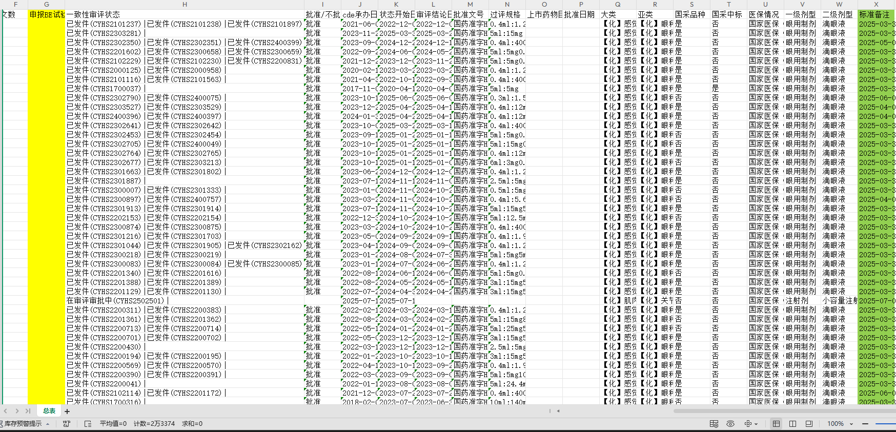
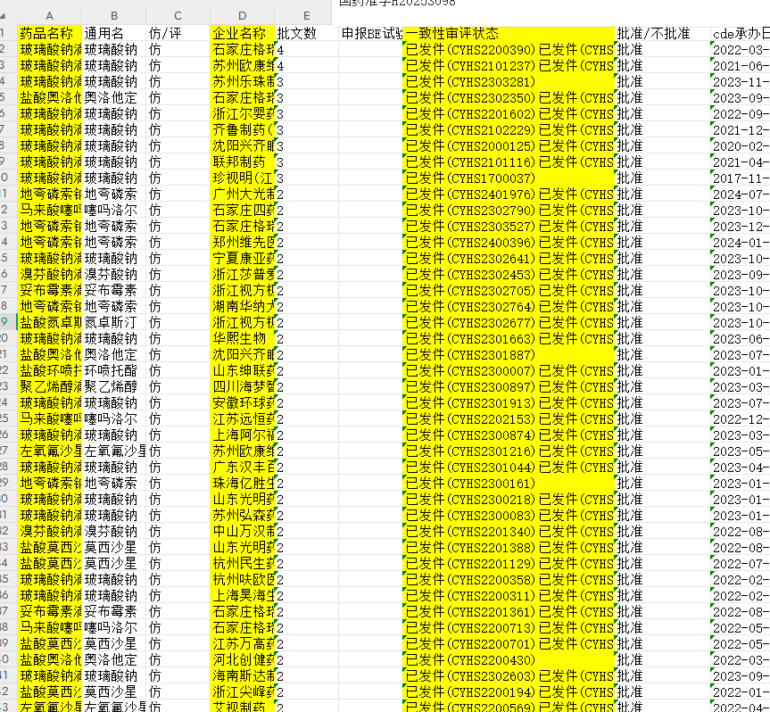
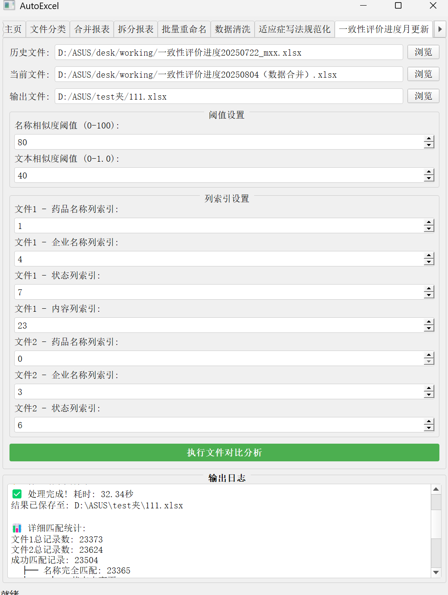
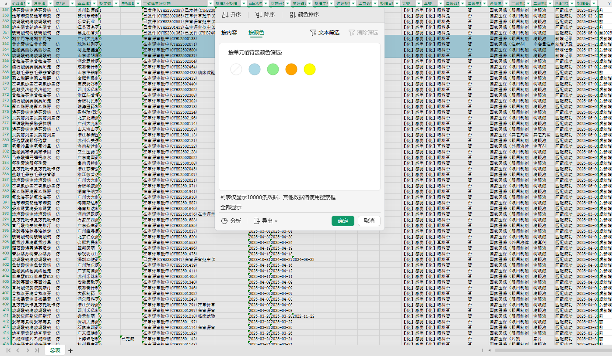

# AutoExcel v1.0

Autolexcel--Excel文件自动化处理工具

## 1. 注意事项

1）即使是不损坏原始文件的复制操作但是建议操作前先备份

2）人工复审是不可规避的一项工作

3）注意所有excel只能有一个sheet表单，目前只支持一个sheet都excel文件

4）两个专项的功能索引是按照计算机逻辑从0开始计数：0，1，2，3，然后前几个功能是从1开始计数：1，2，3

## 2. 功能一_文件归类

一键清理杂乱文件

支持三种功能：

1. 根据文件类型分类 比如word excel pdf
2. 根据关键词分类 比如中国经济 城市人口 一致性
3. 根据文件扩展名归类 比如.png .jpg .xlsx .xls

## 3. 一键合并报表

支持匹配特定多个列做匹配，合并多个文件excel

比如表一的城市名和销售额，表二的城市名和销售额，会对照城市名来合并，若两表城市名都在第一列则为1 1，当两个表的城市名在任意列也可以，比如表一的城市名在第一列，表二的城市名在第二列则为1 2。

## 4. 一键拆分报表

根据某一列信息拆分报表，按照年份，按照企业等等

可以支持按行批量分割 逐行分割n行一个文件

可以支持按列批量分割 按列组合分割，1,2 1,3,4 1,4,5(全部逗号都要为英文逗号，然后空格间隔，案例是分成三组)

## 5. 文件批量重命名

对文件命名格式重新按照规定命名，可设置格式

## 6. 数据清洗

重复行 

缺失值 

规范化 单元格去除空格 回车空行 清除指定的符号，或者清除所有符号中英文 

模糊匹配修正

## 7. 适应症写法规范化（menet专项）

注意这里的序列号排序与前面不同，这里是按照计算机的排序习惯从0开始计数，前面几个功能是从1开始计数

索引3对应excel第四列

输入适应症写法规范：

### 7.1. 参数解释

#### 7.1.1. 编辑距离(Edit Distance)功能

是衡量两个字符串相似程度的一种方法。它表示从一个字符串转换成另一个字符串所需要的最少编辑操作次数，这些操作包括：

- 插入一个字符
- 删除一个字符
- 替换一个字符

编辑距离的使用目的如下：

1. **精确控制相似度匹配**：即使两个文本的相似度很高（如超过 85%），但如果它们的编辑距离超过了阈值（如 3），也不会被归一化为同一个标准词。这可以防止一些实际上差异较大的文本被错误地归为一类。
2. **避免误匹配**：有些文本虽然在字符组成上相似度较高，但实际内容可能完全不同。通过设置编辑距离阈值，可以确保只有那些真正相似的文本才会被归一化。
3. **提高归一化准确性**：编辑距离提供了一个量化标准，使得归一化过程更加精确，避免了仅依靠相似度百分比可能带来的误判。

#### 7.1.2. 最小文本长度(Min Text Length)功能

定义了需要进行归一化处理的文本的最小长度。

设置最小文本长度的目的：

1. **避免处理过短文本**：过短的文本（如只有 1-2 个字符）通常没有足够的信息量来判断其相似性，强行归一化可能会导致错误的结果。
2. **提高处理效率**：跳过短文本可以减少不必要的计算，提高整体处理效率。
3. **减少噪声干扰**：很短的文本通常是噪声或特殊符号，对它们进行归一化处理没有实际意义，反而可能干扰正常的归一化过程。
4. **保留原始信息**：对于短文本，通常保留原始形式更有意义，因为它们可能是特殊代码或缩写。

#### 7.1.3. 实际应用示例

例如，在药品适应症描述中：

- "用于治疗高血压" 和 "治疗高血压" 之间的编辑距离很小，相似度很高，会被归一化

- "用于治疗高血压" 和 "治疗糖尿病" 虽然长度相似，但编辑距离较大，不会被归一化

- "治高血" 这样的短文本（长度小于最小长度阈值）会直接保留，不参与归一化处理

  

#### 7.1.4. 结果

生成四个文件

最终处理是结果

另外三个文件是可解释

最终文件结果如下

## 8. 一致性评价进度月更新（menet专项）

仍按照计算机的从0开始到索引

黄色都是匹配列，绿色是前月的备注

文件一：

对应上面的索引1 4

文件二：

生成：

